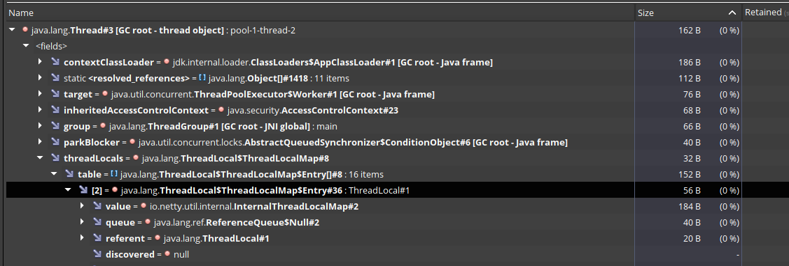

# netty-thread-local-issue

This is a sample project for reproducing Netty issue https://github.com/netty/netty/issues/6891.

## What happens?
When the application is stopped at Tomcat, next error indicating a **probable memory leak** is shown at `catalina.out` log file. 

`01-Dec-2020 15:58:53.339 SEVERE [http-nio-8080-exec-4] org.apache.catalina.loader.WebappClassLoaderBase.checkThreadLocalMapForLeaks The web application [netty-web-client-1.0-SNAPSHOT] created a ThreadLocal with key of type [java.lang.ThreadLocal] (value [java.lang.ThreadLocal@30cfc865]) and a value of type [io.netty.util.internal.InternalThreadLocalMap] (value [io.netty.util.internal.InternalThreadLocalMap@6c95efda]) but failed to remove it when the web application was stopped. Threads are going to be renewed over time to try and avoid a probable memory leak.`

## How to reproduce
This project contains a simple server and two options for reproduce the issue from client side:

1. Simple Netty application.
2. Simple web service for reproducing at Tomcat.

#### Server
Execute `NettyServer` class. It runs a Netty server which returns the received message with next prefix `Hello client!`.  
It receives the port number as program argument. 

For example, using `12345` as port.

`Server listening on: /0:0:0:0:0:0:0:0:12345`

### 1. Simple Netty Application

Execute `NettyClient` class. It runs a Netty client which sends several messages to the server. It receives the host and port where server is listening.

    public static void main(String args[]) throws Exception {
    if (args.length!=2) {
        System.err.println("usage -> NettyClient <host> <port>");
        System.exit(1);
    }

    final AtomicLong i = new AtomicLong(0);

    final ExecutorService executor = Executors.newFixedThreadPool(2);
    final int NTASKS = 100;
    final AtomicInteger finishedTasks = new AtomicInteger(0);
    final Lock l = new ReentrantLock();
    final Condition finishedExecutions = l.newCondition();
    
    for (int e=0;e<NTASKS;e++) {
        executor.execute(() -> {
                try {
                    final NettyClient nettyClient = new NettyClient(args[0], Integer.parseInt(args[1]));
                    nettyClient.sendMessage("My message " + i.incrementAndGet());
                } catch (Exception ex) {
                    ex.printStackTrace();
                } finally {
                    l.lock();
                    if (finishedTasks.incrementAndGet()==NTASKS) {
                        finishedExecutions.signalAll();
                    }
                    l.unlock();
                }
            });
    }

    l.lock();
    if (finishedTasks.get()<NTASKS) {
        finishedExecutions.await();
    }

    System.out.println();   //put a breakpoint
}
`

The application uses an `ExecutorService` for sending the messages. Each invocation of method "sendMessage" opens a new connection, sends the message and closes the connection.

    public void connect() throws Exception {
        accepter = new NioEventLoopGroup(2, new MyThreadFactory("Accepter"));
        executors = new DefaultEventExecutorGroup(2, new MyThreadFactory("EvtExecutor"));
        final Bootstrap b = new Bootstrap();
        b.group(accepter)
            .channel(NioSocketChannel.class)
            .handler(new ChannelInitializer<>() {
                @Override
                protected void initChannel(Channel channel) throws Exception {
                    channel.pipeline()
                        .addLast(new StringDecoder(CharsetUtil.UTF_8))
                        .addLast(new StringEncoder(CharsetUtil.UTF_8))
                        .addLast(executors, new ClientHandler());
                }
            });

        System.out.println("Connecting netty client with thread: " + Thread.currentThread().getName());
        clientChannel = b.connect(host, port).sync();
    }
    
    public void disconnect() throws InterruptedException {
        clientChannel.channel().disconnect();
        if (accepter!=null) {
            accepter.shutdownGracefully();
        }
        if (executors!=null) {
            executors.shutdownGracefully();
        }
    }

    public void sendMessage(String msg) throws Exception {
        connect();
        clientChannel.channel().writeAndFlush(msg).sync();
        disconnect();
    }
    
So, method `b.connect(host, port)` is executed from a thread of the `ExecutorService`. 

When this happens, the method `slowGet` from class `InternalThreadLocalMap` is executed. At that method, an instance of `InternalThreadLocalMap` is associated as `ThreadLocal` variable to that thread. The variable **is never removed** from the thread.

For checking this, **put a breakpoint at line** `System.out.println();   //put a breakpoint`. When breakpoint is reached the Netty connections have been finished and closed. Obtain a heapdump from the java process.

At heapdump, search for `Thread` objects. As the thread factory is the default, their names would be like `pool-1-thread-2`. For more information, `NettyClient` class prints the thread name that opens the connection. For example:

`Connecting netty client with thread: pool-1-thread-2`

The thread instance has the `io.netty.util.internal.InternalThreadLocalMap` at its _threadLocals_ attribute.

 
### 2. Simple web service for reproducing at Tomcat.

At `TestController` there is simple REST web service with an endpoint that sends a message to the `NettyServer` using same `NettyClient` instance than previous example. So, a connection will be opened, used and closed per request.
 
Execute a `mvn clean package` at "netty-client" module for generating the WAR, and put that file on a tomcat server.

Once the application is deployed at tomcat, execute next curl commands for accessing the service.
  
    $ curl http://localhost:8080/netty-web-client-1.0-SNAPSHOT/nettyTest?msg=hi
    Sending message ...   
    $ curl http://localhost:8080/netty-web-client-1.0-SNAPSHOT/nettyTest?msg=hi
    Sending message ...
    `   

Go to http://localhost:8080/manager/html and **stop** the web application. Open the **catalina.out** log file. Next lines appear with the memory leak message:

    01-Dec-2020 15:58:53.337 SEVERE [http-nio-8080-exec-4] org.apache.catalina.loader.WebappClassLoaderBase.checkThreadLocalMapForLeaks The web application [netty-web-client-1.0-SNAPSHOT] created a ThreadLocal with key of type [java.lang.ThreadLocal] (value [java.lang.ThreadLocal@30cfc865]) and a value of type [io.netty.util.internal.InternalThreadLocalMap] (value [io.netty.util.internal.InternalThreadLocalMap@483c9b48]) but failed to remove it when the web application was stopped. Threads are going to be renewed over time to try and avoid a probable memory leak.
    01-Dec-2020 15:58:53.339 SEVERE [http-nio-8080-exec-4] org.apache.catalina.loader.WebappClassLoaderBase.checkThreadLocalMapForLeaks The web application [netty-web-client-1.0-SNAPSHOT] created a ThreadLocal with key of type [java.lang.ThreadLocal] (value [java.lang.ThreadLocal@30cfc865]) and a value of type [io.netty.util.internal.InternalThreadLocalMap] (value [io.netty.util.internal.InternalThreadLocalMap@6c95efda]) but failed to remove it when the web application was stopped. Threads are going to be renewed over time to try and avoid a probable memory leak.

For more information, take a heapdump from tomcat process and verify the threads used for opening the connection. At _catalina.out_ should be some lines with the thread names:

    Connecting netty client with thread: http-nio-8080-exec-1
    Connecting netty client with thread: http-nio-8080-exec-2
    
    
The thread objects that opened the connection contain references to the `io.netty.util.internal.InternalThreadLocalMap`. But the application was already stopped.
")
  